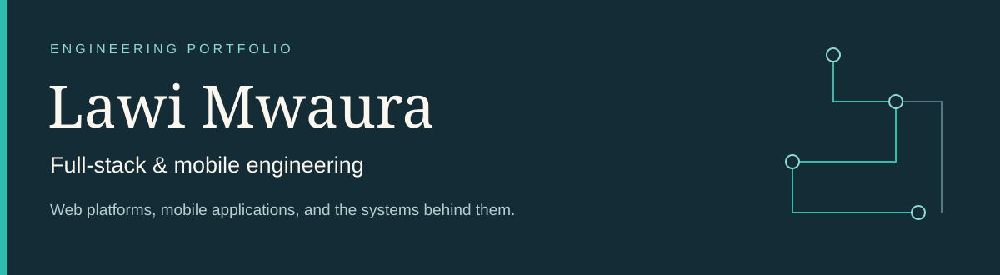

  

I’m **Lawi Mwaura**, a full-stack and mobile engineer based in Kenya. I build across web interfaces, mobile applications, backend integrations, and data consistency. My current work is **I-soco** and **Maly**.

**Open to senior full-stack and product engineering roles at startups.**

[Email](mailto:lawimwaura@gmail.com) · [Engineering documentation](case-studies/README.md)

## 01 / I-soco

**A marketplace application with a focus on reliable asynchronous workflows.**

Actual interface excerpt. Seller identities, amounts, and commercial details are excluded.

The difficult part is keeping the interface and persisted state consistent when external events repeat, arrive late, or contradict an earlier result. The implementation uses server-side verification, database transactions, row locking, and deduplication to protect state transitions.

**Engineering focus:** idempotency · reconciliation · access boundaries · recovery UX · coordinated releases

**Stack:** TypeScript, Next.js, React, Supabase, PostgreSQL

**[Read the system design →](https://github.com/Lawi-Mwaura/I-soco-showcase)**

## 02 / Maly

**A mobile personal finance application with on-device transaction ingestion.**

  
  &nbsp;&nbsp;
  

Actual application components rendered in an isolated preview. All financial values are sample data.

The engineering challenge is turning inconsistent device messages into useful records while handling interruptions, repeated inputs, authentication, and local state. Parser fixtures, paginated inbox recovery, deduplication, and explicit cleanup make those boundaries testable.

**Engineering focus:** parsing · resumable ingestion · local state · session isolation · mobile authentication

**Stack:** TypeScript, React Native, Expo, Supabase, TanStack Query, Zustand

**[Read the system design →](https://github.com/Lawi-Mwaura/Maly-showcase)**

## Supporting projects

| Project | Engineering focus | Technologies |
| :--- | :--- | :--- |
| [Shenachafiber](https://github.com/Lawi-Mwaura/shenachafiber) | Validated enquiries, durable storage, notification failure handling. | TypeScript, Next.js, React, PostgreSQL, Vitest |
| [Catherine Gathoni](https://github.com/Lawi-Mwaura/Catherine-Gathoni-showcase) | Public forms, content workflows, administrative access boundaries. | TypeScript, Next.js, React, Supabase, Resend, Tiptap |
| [Always Organic](https://github.com/Lawi-Mwaura/Always-Organic-showcase) | Storefront state, data queries, runtime input validation. | TypeScript, Next.js, React, Supabase, TanStack Query, Zod |

## What I bring to a team

| Area | Evidence in these projects |
| :--- | :--- |
| System design | Explicit boundaries between UI state, trusted server operations, and durable records. |
| Reliability | Replayed events, delayed callbacks, failed scans, and recovery paths treated as design inputs. |
| Data protection | Restricted browser access, user-scoped cleanup, and separate authentication decisions. |
| Delivery | Regression tests and compatibility checks across application code and database changes. |
| Product engineering | Interfaces that explain state and give users a concrete next action after failure. |

I-soco, Maly, Catherine Gathoni, and Always Organic have private source repositories. Shenachafiber provides public source. The case studies cover engineering decisions and sanitized interfaces; proprietary commercial logic is omitted.
