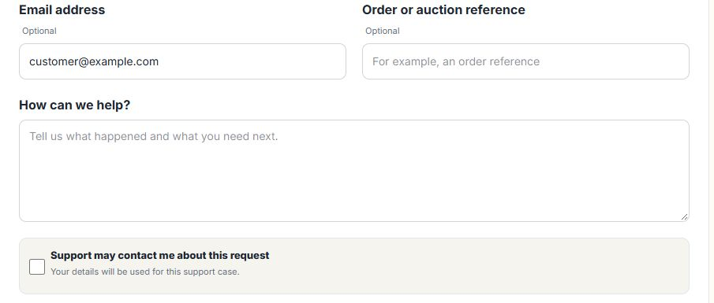
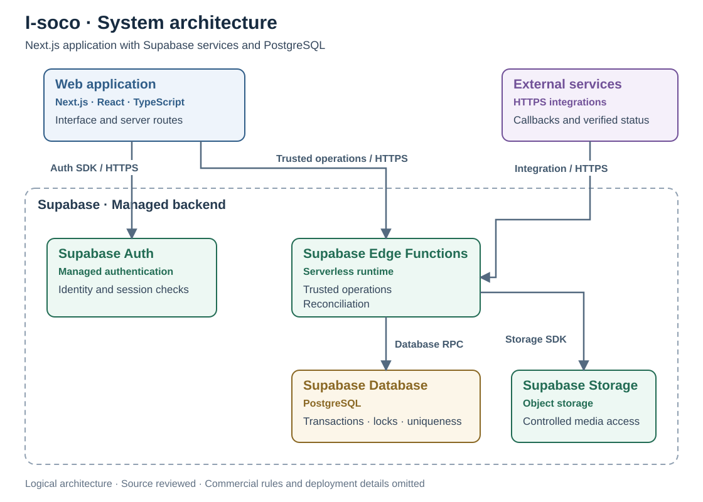
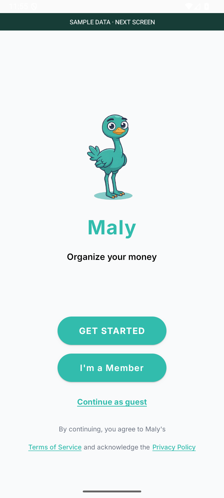
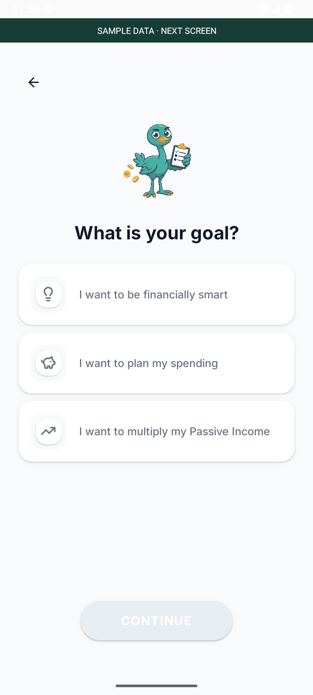
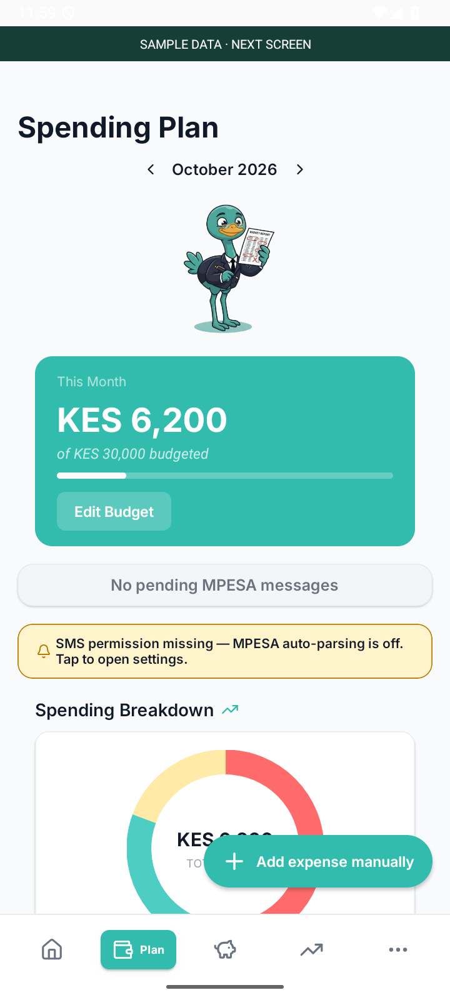
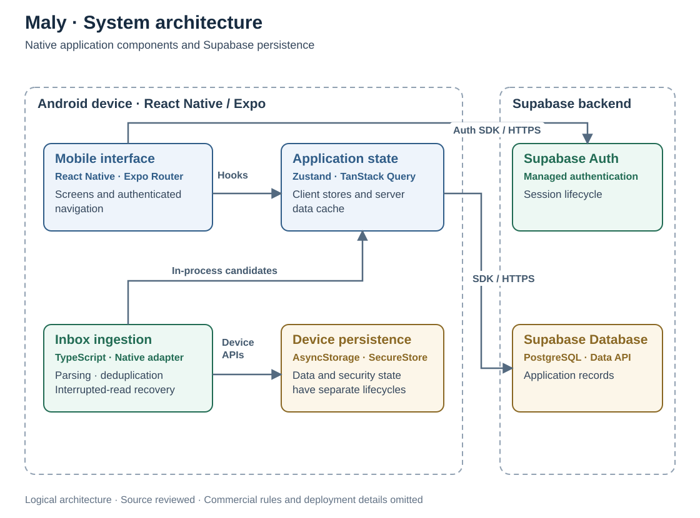
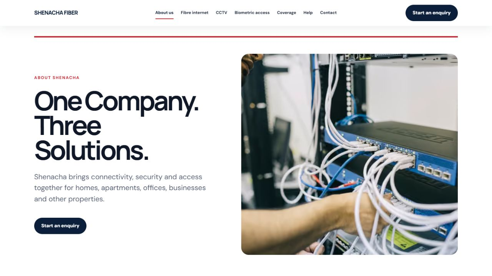
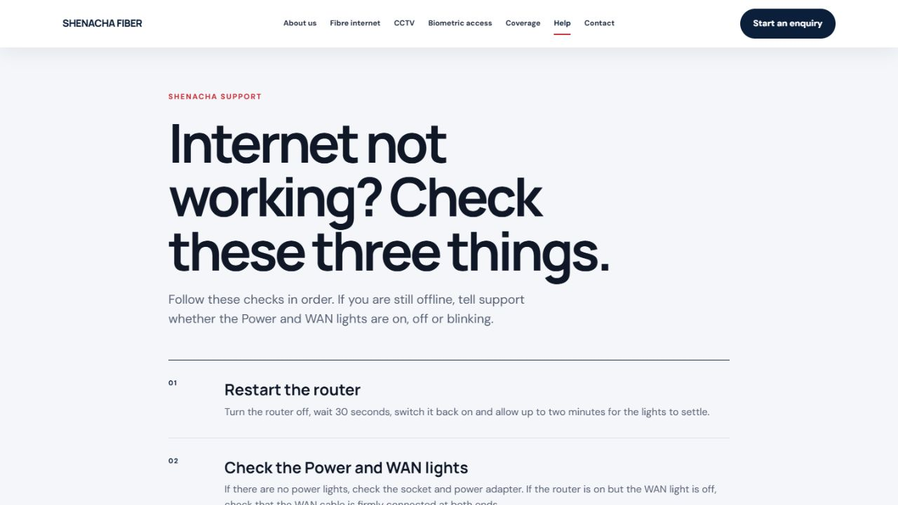
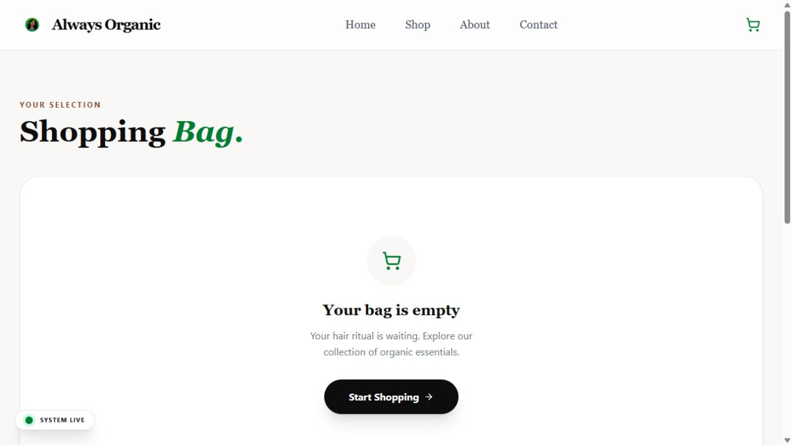

# Lawi Mwaura

**Full Stack Engineer · Nairobi, Kenya**

TypeScript · JavaScript · Next.js · React Native · Kotlin · PostgreSQL

I build web applications, APIs and mobile products, with engineering experience at **Quantum Technologies** and a QA background at **Testbirds**.

**Seeking mid-level full stack engineering roles.**

[Email me](mailto:lawimwaura@gmail.com) · [Technical documentation](case-studies/README.md) 

<strong>All technologies & tools</strong> · web, native Android, backend, cloud, testing and monitoring

## Technologies & tools

These technologies come from my updated résumé and the project source reviewed for this portfolio. Each case study identifies its own stack.

| Area | Technologies & tools |
| :--- | :--- |
| Languages & web foundations | TypeScript, JavaScript, Kotlin, SQL, HTML, CSS |
| Web & API development | React, Next.js, Node.js, REST APIs |
| Mobile & native Android | React Native, Expo, Expo Router, Android SDK, BroadcastReceiver, React Native bridge |
| Databases & backend services | PostgreSQL, Supabase Auth / Database / Edge Functions / Storage, Neon, Drizzle ORM |
| State, forms & device storage | TanStack Query, Zustand, React Hook Form, Zod, AsyncStorage, Expo SecureStore |
| Interface, content & visualization | Tailwind CSS, NativeWind, shadcn/ui, Radix UI, Tiptap, MDX, Framer Motion, Lenis, Leaflet / React Leaflet, React Native Skia, Reanimated, Victory Native |
| Cloud, hosting & delivery | Google Cloud Platform (GCP), Docker, Git, GitHub Actions, Expo Application Services (EAS), Vercel, Truehost; CI/CD for Android beta releases |
| Integrations & verification | Resend, IntaSend, HMAC signature verification |
| Monitoring & analytics | Grafana Faro, Sentry, Vercel Analytics |
| Automated testing | Playwright, Jest, Vitest, Node.js test runner, Testing Library |
| API testing & QA tooling | Postman, Jira, Boxcryptor (authorized pre-release testing) |
| Development tooling | OpenAI Codex, TypeScript tooling, ESLint, Babel, PostCSS |

### Supporting project libraries

The selected repositories also include Axios, React Navigation, NetInfo, Gesture Handler, React Native Screens, Safe Area Context, React Native SVG, React Native Web, React Native Wagmi Charts, date-fns, Lucide, Phosphor Icons, React Icons, Expo Vector Icons, Sonner, next-themes, cmdk, class-variance-authority, tailwind-merge, tw-animate-css, Lightning CSS, Autoprefixer, Simple Icons, parse5, and Fontsource / Expo Google Fonts. Expo modules cover notifications, background tasks, updates, haptics, images, linking, fonts, splash screens, device information and secure storage.

These are supporting libraries identified in direct project dependencies, not separate claims of specialist expertise.

## Selected engineering work

### 01 · I-soco — reliable asynchronous workflows

**Problem statement.** People using a time-limited marketplace need to discover products, follow changing listing states and understand whether their actions completed. An unclear or contradictory result can leave someone unsure whether to wait, retry or seek help. I-soco provides product discovery and visible workflow states around those interactions.

**Engineering challenge.** External events can repeat, arrive late, or contradict an earlier response. Persisted state and the user interface must converge without applying a durable effect twice.

  
  

  
  
  

Product discovery · Notifications · Sign-in · Account creation · Support. Sanitized source QA captures. Open any screenshot for detail.

**Technologies.** TypeScript · JavaScript · Next.js · React · Tailwind CSS · Supabase · PostgreSQL · Drizzle ORM · Zod · Grafana Faro · Docker · IntaSend · Playwright

| Challenge | System design decision | Implemented outcome |
| :--- | :--- | :--- |
| Duplicate events and concurrent writes | Transactional updates, row locks, event and effect uniqueness | Replays follow an already-applied path. |
| Late or contradictory responses | Server verification and guarded state transitions | Confirmed state is protected from downgrade. |
| Timeouts and incomplete operations | Reconciliation and explicit recovery states | The interface distinguishes uncertainty from a terminal result. |

<strong>System architecture · Next.js and Supabase</strong>

**Tradeoff:** database coordination keeps correctness in one boundary, but can introduce contention. Lock waits and reconciliation latency should be measured before changing that boundary.

**Metrics & evidence.** **13 selected tests passed** for reliability, recovery, security contracts, and release compatibility. These are regression checks; production latency, throughput, and availability have not been established by this review.

**[Read the engineering case study →](https://github.com/Lawi-Mwaura/I-soco-showcase)**

### 02 · Maly — mobile ingestion and session isolation

**Problem statement.** Managing everyday finances is difficult when spending records are scattered across messages and a budget has to be reconstructed manually. People need a usable view of transactions, spending plans and savings goals. Maly brings those records and planning tools into a mobile interface.

**Engineering challenge.** Device messages are inconsistent, inbox reads can stop midway, and cached financial data must be cleared when sessions change.

  
  
  
  
  

Welcome · Goals · Sign-in · Spending plan · Transaction entry. Actual Android emulator captures with synthetic fixtures. Open any screenshot for detail.

**Technologies.** TypeScript · React Native · Expo / EAS · Expo Router · Kotlin · Android SDK · Supabase · PostgreSQL · Node.js · TanStack Query · Zustand · AsyncStorage / SecureStore · NativeWind · GitHub Actions · Grafana Faro · Sentry · Jest

| Challenge | System design decision | Implemented outcome |
| :--- | :--- | :--- |
| Inconsistent or unrelated messages | Recognition, normalization, and parser fixtures | Supported transactions are separated from unrelated messages. |
| Interrupted and repeated inbox reads | Paginated scanning, overlap, deduplication, guarded cursor advancement | Failed reads preserve the previous scan cursor. |
| Stale state across sessions | Explicit cleanup of queues, user storage, and query cache | Data cleanup has a separate lifecycle from authentication and PIN state. |

<strong>System architecture · Expo and Supabase</strong>

**Tradeoff:** bounded scans limit device work; page-cap exhaustion needs further validation before claiming complete ingestion of any inbox size. Overlap requires reliable deduplication.

**Metrics & evidence.** **55 tests passed across five selected suites:** parsing, inbox recovery, user-state cleanup, authentication routing, and PIN storage. Device and storage boundaries are mocked in these tests; emulator images demonstrate native rendering, not end-to-end ingestion or production performance.

**[Read the engineering case study →](https://github.com/Lawi-Mwaura/Maly-showcase)**

## More project work

### [Shenachafiber](https://github.com/Lawi-Mwaura/shenachafiber)

**Problem statement.** Homes and businesses looking for fibre internet, CCTV or biometric access need to understand the available services and send an enquiry with the right information. They also need a clear indication that their request was received. Shenachafiber provides service information and structured enquiry journeys.

**Engineering challenge.** Enquiries must survive notification failures. Storage determines success; delivery errors are handled separately.

**Technologies:** TypeScript · Next.js · React · Neon / PostgreSQL · Resend · Phosphor Icons · Simple Icons · Vitest · Playwright

  
  
  

Home · About · Help. Existing source QA captures, shown as public interface excerpts. Open an image for detail.

**Evidence:** public source; **27 selected tests passed** across three suites.

### [Catherine Gathoni](https://github.com/Lawi-Mwaura/Catherine-Gathoni-showcase)

**Problem statement.** Readers and prospective collaborators need one place to find Catherine Gathoni's articles, podcast and speaking information, subscribe to updates and get in touch. The website supports those public journeys while keeping content administration separate.

**Engineering challenge.** Public forms and administration need different trust boundaries. Input validation, persistence-first contact handling, and server-side administration checks.

**Technologies:** TypeScript · Next.js · React · Tailwind CSS · Supabase Auth / PostgreSQL · Resend · Tiptap · React Hook Form · Zod · Sentry · Vercel Analytics · MDX · Lenis

  
  
  

Home · About · Journal. Public web captures; About and Journal captured on 2 October 2026. Open an image for detail.

**Evidence:** source-reviewed design and public web captures; no complete test run in this review.

### [Always Organic](https://github.com/Lawi-Mwaura/Always-Organic-showcase)

**Problem statement.** People browsing a personal-care collection need clear product information, an understandable selection process and a cart that preserves their choices as they navigate. Always Organic provides a storefront for product discovery and shopping interactions.

**Engineering challenge.** Storefront state and external-service results need separate lifecycles. Cart state, server queries, runtime validation, and empty-state behavior.

**Technologies:** TypeScript · Next.js · React · Tailwind CSS · Supabase / PostgreSQL · TanStack Query · Zod · Resend · Framer Motion · Axios · Leaflet / React Leaflet · Lucide / React Icons · Sonner · Jest · Testing Library

  
  

Home · Empty shopping bag. Actual public interface captures; no purchase or populated cart is implied. Open an image for detail.

**Evidence:** source-reviewed design and public web captures; existing component tests were not run in this review.

Each project README includes interface screenshots, a system diagram, challenges, outcomes, and a clearly scoped evidence section.

## Education

- **Moringa School:** Software Engineering Bootcamp, graduated 2023.
- **Jomo Kenyatta University of Agriculture and Technology:** Bachelor's degree in Journalism, graduated 2026; Manufacturing and Mechanical Engineering coursework, 2019 to 2022.

**[Get in touch](mailto:lawimwaura@gmail.com)**
