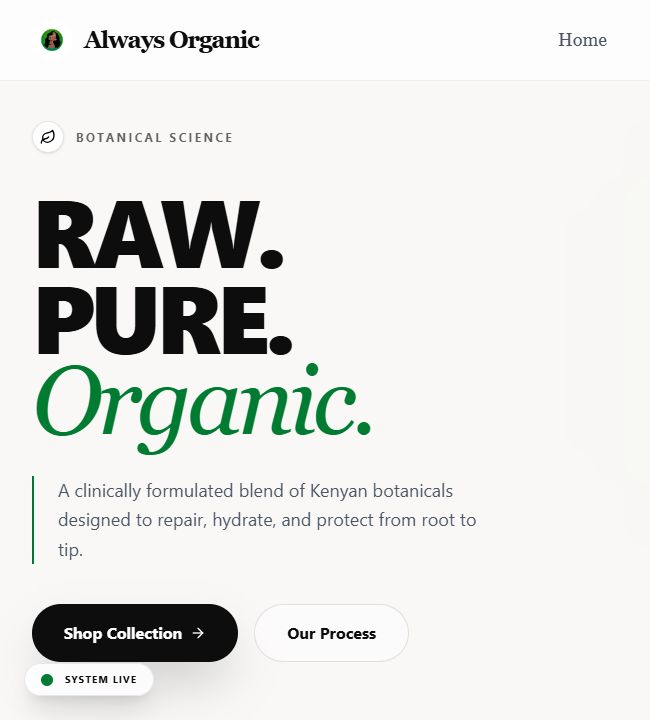
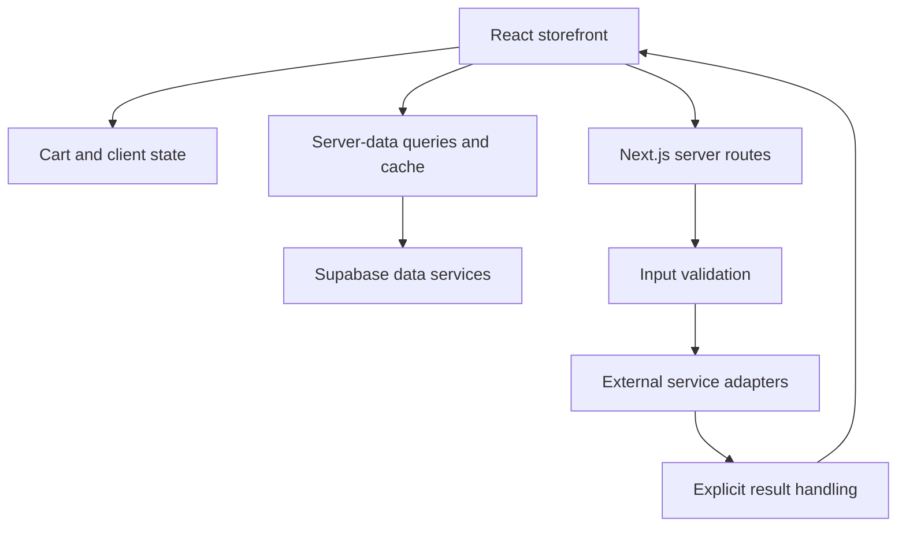

# Always Organic

### Storefront engineering: client state and external service boundaries

[Lawi Mwaura](https://github.com/Lawi-Mwaura) · [Public preview](https://always-organic.vercel.app)

*Actual public homepage excerpt captured on 1 October 2026. Customer records and commercial rules are excluded.*

## Engineering scope

A Next.js and React storefront with product discovery, a cart interface, server-derived data, and service integrations. This public overview covers the software responsibilities rather than commercial operations.

**Technologies:** TypeScript, Next.js, React, Tailwind CSS, Supabase, TanStack Query, Zod, Resend, Framer Motion.

## System design

*Simplified responsibility map. It omits commercial rules, provider identifiers, private schema, and customer data.*

| Concern | Source evidence |
| :--- | :--- |
| Client versus server state | The application uses React for interface state and TanStack Query for server-data workflows. |
| Runtime input validation | A server notification route validates the shape of the request with Zod before processing it. |
| External services | Integrations are implemented through server routes rather than represented only as visual controls. |
| Empty-state behavior | Existing cart component tests cover the empty-cart message and a return-to-shop link. |
| Presentation | Shared header, footer, product-card, and homepage components separate presentation responsibilities. |

## Design decisions and tradeoffs

**A cart is client state, but a completed external operation requires authoritative confirmation.** Interface state and server records should have distinct lifecycles. This distinction is the starting point for testing repeated actions, refreshed sessions, and stale cached data.

**Integration results need an explicit contract.** Input validation prevents malformed payload shapes from entering a service adapter. It does not, by itself, establish authorization, delivery, or an end-to-end successful operation. Those concerns need their own checks and consistent result handling.

**Empty and unavailable states are part of the interface.** A component should explain what the user can do when there is no data. The existing cart tests are a small example of this; they are not a complete integration suite.

## Validation scope

This showcase update reviewed the application structure, selected route logic, and existing component-test coverage, and captured the public interface. The cart tests and live service integrations were not executed during this documentation update. Next verification priorities are client-state restoration, query invalidation, validation failures, and external-service error contracts.

Source remains private. This repository contains only interface captures and an engineering overview; commercial logic is omitted.

[Contact Lawi](mailto:lawimwaura@gmail.com)
