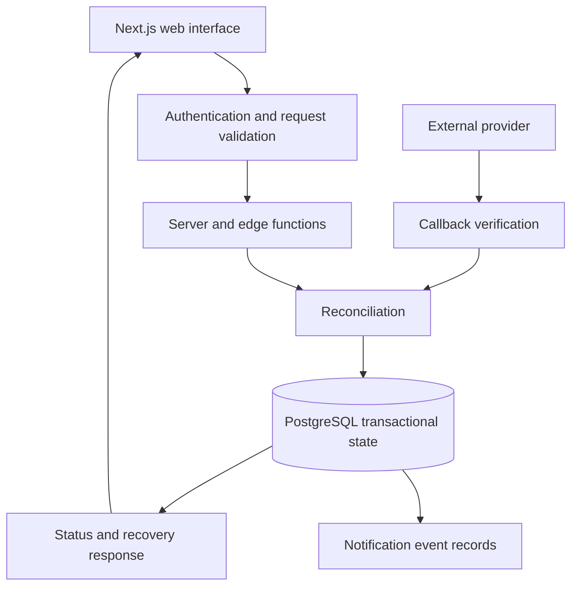
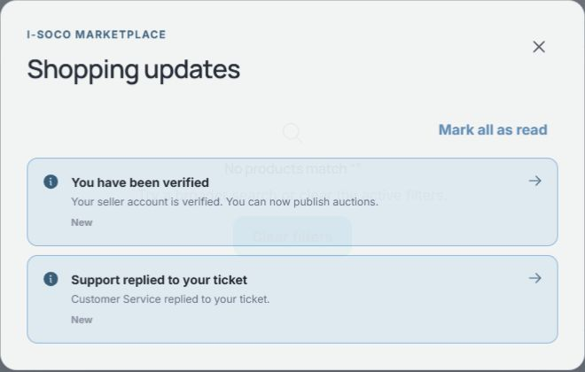

# I-soco

### Marketplace engineering: consistent state across unreliable events

[Profile](../README.md) · [Documentation index](README.md) · [Maly](maly.md)

*Actual discovery interface excerpt. Seller identities, amounts, and commercial details are excluded.*

## Engineering scope

I-soco combines a Next.js web interface with Supabase services and PostgreSQL. This case study focuses on asynchronous event processing, consistency, security boundaries, and recovery. Source code and commercial workflows remain private.

| Layer | Responsibility |
| :--- | :--- |
| React / Next.js | Discovery, navigation, authenticated interactions, and visible workflow states. |
| Server / edge functions | Validate requests, verify provider state, and coordinate reconciliation. |
| PostgreSQL | Enforce transactional state changes, uniqueness, and concurrent-write boundaries. |
| External services | Produce callbacks and status responses that may arrive late or repeat. |
| Regression and release checks | Protect recovery behavior and compatibility between function code and database migrations. |

## System design

*Simplified responsibility map. It omits proprietary entities, endpoint names, commercial rules, and deployment details.*

The browser displays state; the trusted server path verifies external information; the database applies changes within a transaction. This boundary matters because a redirect or an optimistic screen update cannot establish that an external operation completed.

### 1. Repeated events must converge

**Failure:** an external service retries a callback, or reconciliation processes an event again after an interruption. A naive handler repeats a durable side effect.

**Design:** deduplicate provider events, lock the record being updated, and enforce uniqueness on the side effect. The database function coordinates the related changes within a transaction. A repeat can return an already-applied result without adding another mutation.

**Invariant:** replaying a verified event must preserve the final state and must not repeat its durable effect.

**Tradeoff:** database coordination couples this operation to PostgreSQL and can create contention around a busy record. It keeps the consistency boundary small and inspectable. Before distributing this work across more services, I would measure lock wait time and transaction duration.

### 2. Late events must not undo confirmed state

**Failure:** a stale intermediate or failed status arrives after a successful confirmation. Updating the record according to arrival order makes the interface regress.

**Design:** confirmed-state protection prevents a completed record from being downgraded by a later contradictory event. Reconciliation preserves the relationship between internal attempts and verified provider references. Handling delayed work also distinguishes when a verified event was received from when a worker applied it.

**Invariant:** processing order alone does not determine the authoritative final state.

**Tradeoff:** state-transition rules require more deliberate maintenance than assigning the latest string returned by a provider. They make recovery and investigation substantially easier to reason about.

### 3. Uncertainty needs a recovery path

**Failure:** a request times out while the external operation is still unresolved. Treating uncertainty as success misleads the user; treating it as a definite failure can trigger unnecessary repeat actions.

**Design:** distinguish unresolved, confirmed, and terminal failure states. Recovery behavior directs users to a relevant next action and preserves unresolved attempts for later reconciliation. A verified terminal failure is not displayed as indefinitely pending.

**Invariant:** the interface should report what the system knows and offer a next step that matches that state.

*Actual notification interface excerpt showing generic verification and support updates. The surrounding commercial content is excluded.*

### 4. Access and release boundaries are part of correctness

Privileged mutations stay behind trusted server operations. The source includes a security migration that restricts browser table access and a redirect allowlist for the external integration.

Database changes and edge-function code also have to agree. A deployment compatibility gate checks those pieces together, rather than assuming that shipping application code is sufficient.

## Validation

On **1 October 2026**, the selected reliability and security checks completed with **13 passing tests**. They cover duplicate-event safeguards, confirmed-state protection, recovery decisions, provider reference handling, delayed reconciliation, access restrictions, and deployment compatibility.

The selected Node suite includes source-contract assertions and recovery-helper checks. Passing it confirms those regression checks; it does not establish live-provider reliability, concurrent production behavior, or a production service-level objective. A separate database regression script covers replay and interruption scenarios; its presence was reviewed, but that SQL script was not executed for this public documentation update.

## Scaling and operational questions

The following are evaluation priorities, not claimed production measurements:

- **Contention:** observe lock waits and reconciliation latency before changing the transaction boundary.
- **Recovery:** track unresolved event age, replay frequency, and failures by processing stage.
- **Delivery:** exercise migration/function compatibility in a staging environment before promotion.
- **Observability:** correlate an attempt across request, callback, reconciliation, and persisted outcome without logging customer payloads.

## Technical discussion

I can walk through the consistency boundary, why duplicate delivery differs from duplicate effects, how late events affect a state machine, and how recovery behavior reaches the interface. The public overview deliberately excludes proprietary commercial logic.

**Stack:** TypeScript · Next.js · React · Supabase · PostgreSQL

[Contact Lawi](mailto:lawimwaura@gmail.com) · [Back to profile](../README.md)
